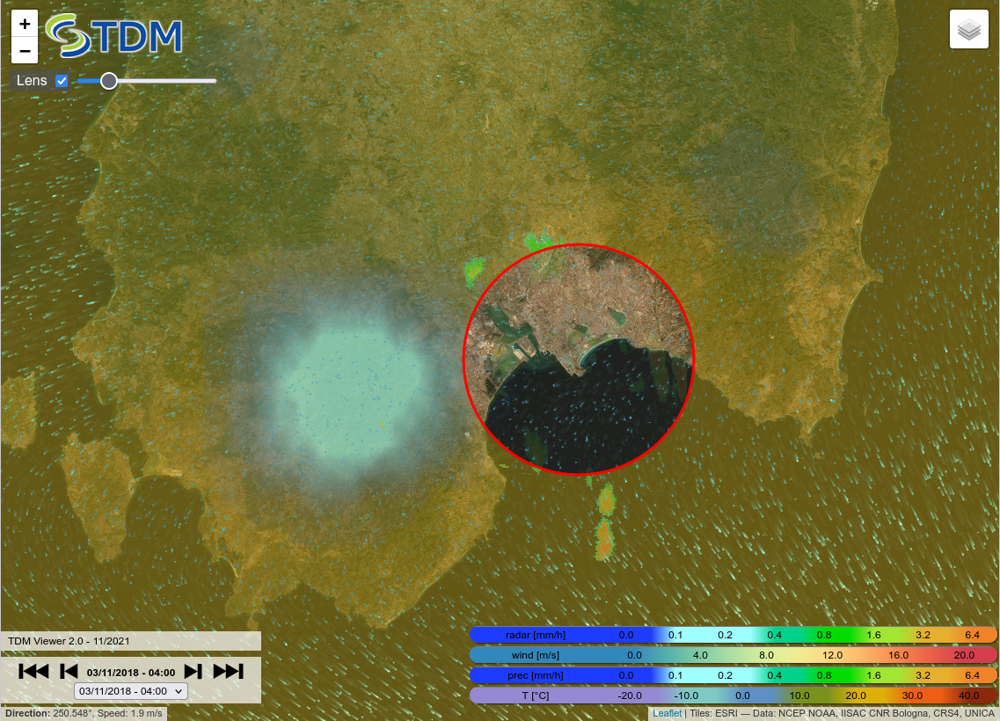

TDM Sparse Coding Library
=========================

[Enrico Gobbetti](mailto:gobbetti@crs4.it) and
[Fabio Bettio](mailto:fabio@crs4.it)

Visual and Data-intensive Computing, CRS4. Italy.

Copyright Notice
----------------

This software is **Copyright (C) 2021 by CRS4, Cagliari, Italy**. It is distributed under the [CC BY-NC-ND 4.0 license](https://creativecommons.org/licenses/by-nc-nd/4.0/legalcode). For use in commercial projects, kindly contact Enrico Gobbetti at CRS4. If you use this software in a publication, kindly cite the references mentioned below. For more information, visit the [CRS4 Visual Computing](http://www.crs4.it/vic/) web page and the [TDM project](http://www.tdm-project.it) web pages. 

Abstract
--------

The **tdm-weather-viewer** is a javascript web app for rendering georeferenced raster or vector weather data that are displayed on a Leafletjs map.
For georeferenced rasters the software extends the Leaflet Layer class to embed the GeoTIFF format.
The raster images include various types of 2D scalar maps such as: precipitation, cloud cover, temperature, etc...
The implemented vector data are 2D maps of wind direction and speed rendered by particle tracing.
The format of the REST API to access weather data are specified at http://data.tdm-project.it/.

The viewer allows the exploration of meteorological data placed in Leaflet layers. The user can select the layers to be displayed in the popup menu at the top right. 
An interactive lens "perforates" the layers, allowing the user to have a more precise detail on the geographical position of the data.

Using the code
--------------

Clone the app into a web server directory:
```
git clone https://github.com/tdm-project/tdm-weather-viewer.git
```
Verify the correct functioning of the app via a web browser

Additional documentation is availabile in Deliverable DXXXXX on the [TDM project deliverables FIXME](http://www.tdm-project.it/en/results/public-deliverables/) web site.

Acknowledgments
---------------

This work was partially suppored by Sardinian Regional Authorities under
projects VIGECLAB and TDM (POR FESR 2014-2020 Action 1.2.2).

References
----------

- Jose Díaz, Fabio Marton, and Enrico Gobbetti. Interactive Spatio-Temporal Exploration of Massive Time-Varying Rectilinear Scalar Volumes based on a Variable Bit-Rate Sparse Representation over Learned Dictionaries. Computers & Graphics, 88: 45-56, 2020. DOI: [j.cag.2020.03.002](https://doi.org/10.1016/j.cag.2020.03.002)

- Fabio Marton, Marco Agus, and Enrico Gobbetti. A framework for GPU-accelerated exploration of massive time-varying rectilinear scalar volumes. Computer Graphics Forum, 38(3): 53-66, 2019. DOI: [10.1111/cgf.13671](https://doi.org/10.1111/cgf.13671)

- Enrico Gobbetti, José Antonio Iglesias Guitián, and Fabio Marton. COVRA: A compression-domain output-sensitive volume rendering architecture based on a sparse representation of voxel blocks. Computer Graphics Forum, 31(3pt4): 1315-1324, 2012. DOI: [j.1467-8659.2012.03124.x](https://doi.org/10.1111/j.1467-8659.2012.03124.x)


